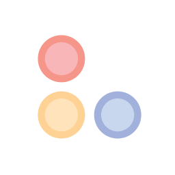

<!-- PROJECT LOGO -->
 

  

<h3 align="center">Lotion</h3>

  

    Organize your tasks and calendar events in a streamlined, centralized, and customizable fashion to meet productivity needs and goals. You should be using Lotion every day.
     
     
    <a href="https://github.com/MatthewBlam/Lotion/releases">Download</a>
    ·
    <a href="https://www.youtube.com/watch?v=cqKX93PYYq4">View Demo</a>
    ·
    <a href="https://github.com/MatthewBlam/Lotion/issues">Report Bug</a>
    ·
    <a href="https://github.com/MatthewBlam/Lotion/issues">Request Feature</a>
  

<!-- TABLE OF CONTENTS -->

  
Table of Contents

  <ol>
    <li><a href="#about-the-project">About The Project</a></li>
    <li><a href="#run-lotion">Run Lotion</a></li>
    <li><a href="#usage">Usage</a></li>
    <li><a href="#roadmap">Roadmap</a></li>
    <li><a href="#suggestions-and-contributions">Suggestions and Contributions</a></li>
    <li><a href="#license">License</a></li>
    <li><a href="#contact">Contact</a></li>
  </ol>

<!-- ABOUT THE PROJECT -->
## About The Project

[![Lotion Screen Shot][product-screenshot]](https://github.com/MatthewBlam/Lotion)
[![Lotion Screen Shot (Dark)][product-screenshot-dark]](https://github.com/MatthewBlam/Lotion)

### Built With

<!-- GETTING STARTED -->
## Run Lotion

You can <a href="https://github.com/MatthewBlam/Lotion/releases">download Lotion</a> for Mac and Windows. Alternatively, if you are familiar with Electron and wish to compile Lotion yourself, clone this repo and run Lotion as a project or use electron-builder to compile the binaries.
 
**NOTE** that if you elect to download Lotion instead of compiling it, your computer operating system or antivirus may flag Lotion as you are downloading it from the internet.

<!-- USAGE EXAMPLES -->
## Usage

For a walk-through of how to use the program and it's features, please watch <a href="https://www.youtube.com/watch?v=cqKX93PYYq4">this video</a>.

<!-- ROADMAP -->
## Roadmap

- [ ] Linux build
- [ ] Integrate services such as Google Calendar, Google Classroom, etc.
- [ ] Implement suggestions & fix any bugs

See the [open issues](https://github.com/MatthewBlam/Lotion/issues) for a full list of proposed features (and known issues).

<!-- CONTRIBUTING -->
## Suggestions and Contributions

If you have any suggestions or ideas, please open an issue with the tag "enhancement". All feedback is **greatly appreciated**. You can also fork the repo and create a pull request. Thank you!

<!-- LICENSE -->
## License

Distributed under the MIT License. See `LICENSE.txt` for more information.

<!-- CONTACT -->
## Contact

Matthew Blam - blammatthew@gmail.com

Project Link: [https://github.com/MatthewBlam/Lotion](https://github.com/MatthewBlam/Lotion)

<a href="#readme-top">back to top</a>

<!-- MARKDOWN LINKS & IMAGES -->
<!-- https://www.markdownguide.org/basic-syntax/#reference-style-links -->
[product-screenshot]: images/Lotion%20Screenshot.png
[product-screenshot-dark]: images/Lotion%20Screenshot%20Dark.png
[logo]: logo/Lotion.png
